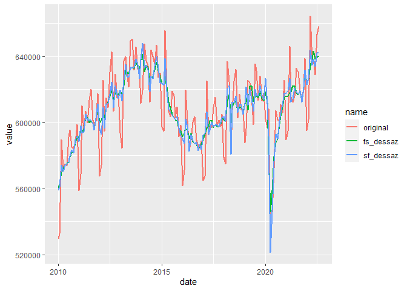
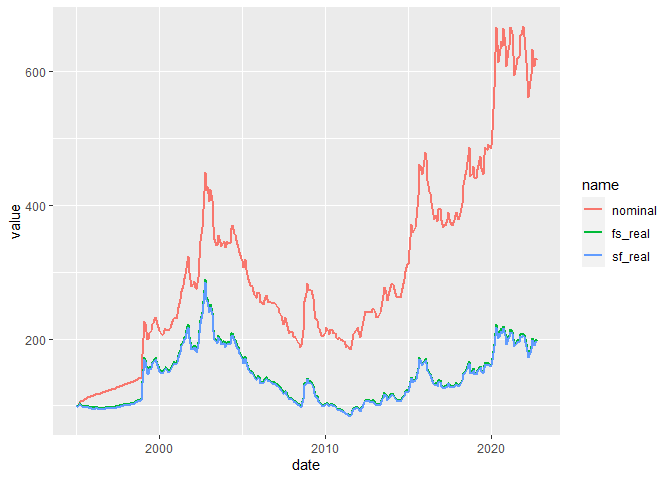
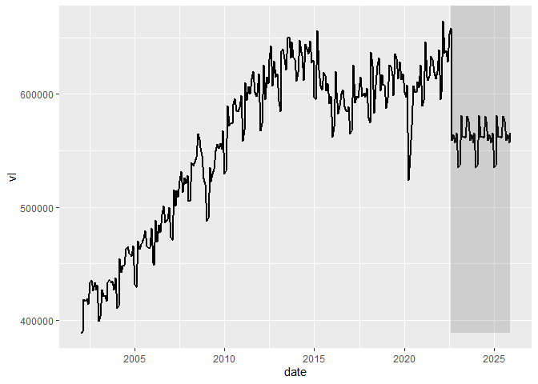
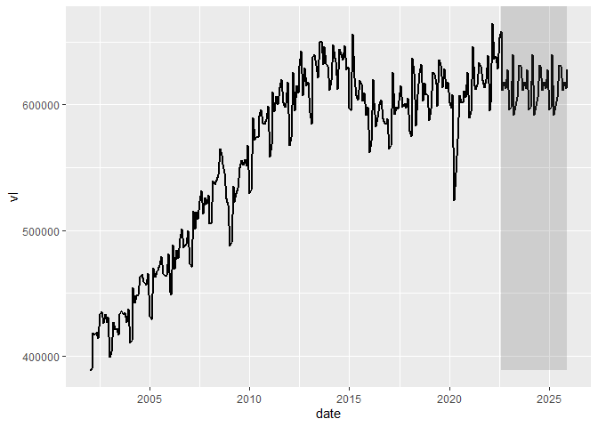

## Utils

Funções que não realizam projeções, mas são úteis e fornecem suporte ao
trabalho.

### load\_clean\_series

Carrega as séries do 4macro em formato *tibble*.  
As séries são retornadas empilhadas, organizadas pela coluna sid.  
Contém as colunas: sid, date, forecast, vl

``` r
data <- simpleforecasts::load_clean_series(
  sid_vl = c(
    'BRGDP0081000ROML', #PIB 4i
    'BRIND0001000OOML', #PIM
    'BRIND0002000OOML', #PIM Extrativa
    'BRIND0003000OOML', #PIM Transformação
    'BRPRC0046000OOML', #IPCA BR
    'USPRC0001000OOML', #IPC US
    'BRFXR0003000OAML', #Cambio R$/USD
    'BRFXR0031000OODL', #Cambio Diário
    'BRMTG0003JOIOAML'  #Temperatura Média
    ),
  auth_path = '../auth.ini',
  estimate = F
)
```

### split\_series

Recupera apenas uma das séries carregadas pela fct
*load\_clean\_series*.  
Também permite filtrar se é desejado dado estimado ou não.

``` r
pib_4i <- data %>% 
  simpleforecasts::split_series(sid_vl = 'BRGDP0081000ROML')
```

### get\_seas\_adj

Calcula, automaticamente, a série sem efeito sazonal.  
Utiliza o método X13, STL ou uma média entre eles.

``` r
pib_dessaz <- pib_4i %>% 
  get_seas_adj()
```

<!-- -->

### cambio\_real

Calcula a taxa de câmbio real, utilizando a inflação dos dois países.
Deve-se selecionar um ano-mês para corresponder à base do índice.

``` r
rs_usd <- data %>% 
  split_series('BRFXR0003000OAML') %>% 
  filter(date >= '1994-12-01')

ipca <- data %>% 
  split_series('BRPRC0046000OOML')

ipc_us <- data %>% 
  split_series('USPRC0001000OOML')
```

``` r
rs_usd_real <- simpleforecasts::cambio_real(
  df = rs_usd,
  df_ipc_dom = ipca,
  df_ipc_int = ipc_us,
  mes_base = '1995-01-01'
) 
```

<!-- -->

## Simples

Funções que realizam projeções simples, sem qualquer modelo de série de
tempo. Elas devem funcionar tanto para periodicidade mensal quanto
trimestral.

Existem três grupos:

1.  Utiliza informação histórica da própria série:

<!-- -->

1.  sf\_naive: repete último valor;
2.  sf\_snaive: repete último valor/média de X anos para um mesmo mês;
3.  sf\_drif: opção *hist*, utiliza tendência histórica de X anos;

<!-- -->

2.  Utiliza uma informação inserida manualmente:

O dado passado como parâmetro pode provir de uma projeção feita em
periodicidade maior (de anual para mensal; de mensal para diária). Ou
então provir de uma premissa (0.1% de crescimento mensal; YoY de 5%)

1.  sf\_drift: opções *manual* e *target*, adicionam tendência com base
    em crescimento mensal esperado ou em um alvo para o último mês;
2.  sf\_target: equivalente ao sf\_drift opção *target*, com a diferença
    que adiciona sazonalidade, por meio do fator sazonal médio
    histórico;
3.  sf\_aop: projeta utilizando YoY médio para o ano. Compatibiliza o
    YoY para o restante do primeiro para respeitar a média desejada.

<!-- -->

3.  Utiliza projeção calculada em outra série:

<!-- -->

1.  sf\_daily: projeta a série diária como sendo interpolação linear até
    o dado para o mês, vindo de outra série;
2.  sf\_topdown: utiliza a mesma variação anual que outra série;
3.  sf\_seas\_ratio: projeta a série original a partir de sua projeção
    dessaz;
4.  sf\_conversao\_cambio: projeta um par de câmbio a partir de outros
    dois.

### sf\_naive

Naive forecasting. Repete o último valor realizado até o fim da
projeção.

``` r
pib_naive <- pib_4i %>% 
  simpleforecasts::sf_naive(end_forecast = '2025-12-01')
```

### sf\_snaive

Segue a mesma ideia do *sf\_naive*, no entanto, ao invés de repetir o
último valor, repete o valor médio do histórico para o mesmo mês.

O parâmetro *nyears* permite selecionar X anos do histórico para
calcular a média dos valores para o mês. Se vazio, utiliza a média do
histórico.

``` r
pib_snaive <- pib_4i %>% 
  simpleforecasts::sf_snaive(end_forecast = '2025-12-01')
```

<!-- -->

``` r
pib_snaive_5y <- pib_4i %>% 
  simpleforecasts::sf_snaive(nyear = 5, end_forecast = '2025-12-01')
```

<!-- -->
