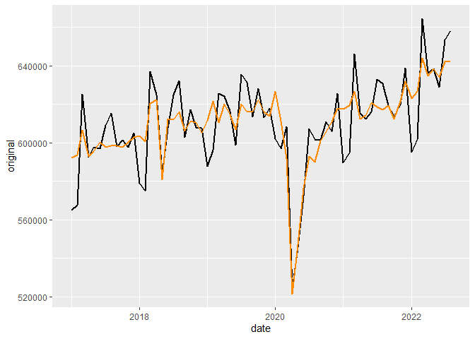

## Utils

Funções que não realizam projeções, mas são úteis e fornecem suporte ao
trabalho.

### load_clean_series

Carrega as séries do 4macro em formato *tibble*.  
As séries são retornadas empilhadas, organizadas pela coluna sid.  
Contém as colunas: sid, date, forecast, vl

``` r
data <- simpleforecasts::load_clean_series(
  sid_vl = c(
    'BRGDP0081000ROML', #PIB 4i
    'BRRTL0021000OOML', #PMC
    'BRSER0001000OOML', #PMS
    'BRIND0001000OOML', #PIM
    'BRIND0002000OOML', #PIM Extrativa
    'BRIND0003000OOML', #PIM Transformação
    'BRPRC0046000OOML', #IPCA BR
    'USPRC0001000OOML', #IPC US
    'BRFXR0003000OAML', #Cambio R$/USD
    'BRFXR0031000OODL', #Cambio Diário
    'BRMTG0003JOIOAML'  #Temperatura Média
    ),
  auth_path = '../auth.ini',
  estimate = F
)
```

### split_series

Recupera apenas uma das séries carregadas pela fct
*load_clean_series*.  
Também permite filtrar se é desejado dado estimado ou não.

``` r
pib_4i <- data %>% 
  simpleforecasts::split_series(sid_vl = 'BRGDP0081000ROML')
```

### get_seas_adj

Calcula, automaticamente, a série sem efeito sazonal.  
Utiliza o método X13, STL ou uma média entre eles.

``` r
pib_dessaz <- pib_4i %>% 
  get_seas_adj()
```



### cambio_real

Calcula a taxa de câmbio real, utilizando a inflação dos dois países.
Deve-se selecionar um ano-mês para corresponder à base do índice.
