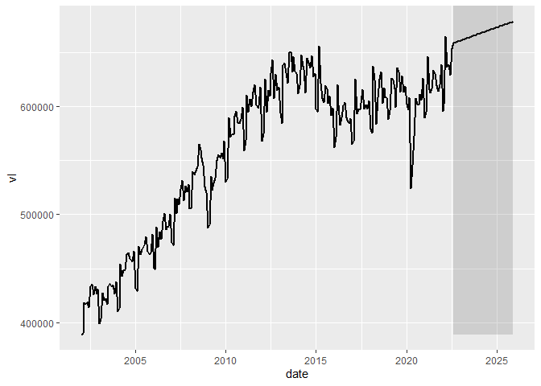
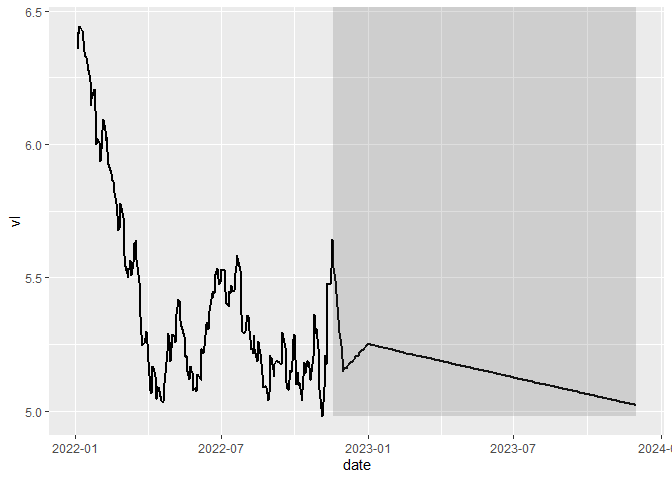

## Utils

Funções que não realizam projeções, mas são úteis e fornecem suporte ao
trabalho.

### load\_clean\_series

Carrega as séries do 4macro em formato *tibble*.  
As séries são retornadas empilhadas, organizadas pela coluna sid.  
Retorna as colunas: sid, date, forecast, vl

Se o parâmetro estimate for TRUE baixa apenas projeções, FALSE apenas
dado realizado e NULL tudo disponível.

``` r
data <- simpleforecasts::load_clean_series(
  sid_vl = c(
    'BRGDP0081000ROML', #PIB 4i
    'BRIND0001000OOML', #PIM
    'BRIND0002000OOML', #PIM Extrativa
    'BRIND0003000OOML', #PIM Transformação
    'BRPRC0046000OOML', #IPCA BR
    'USPRC0001000OOML', #IPC US
    'BRFXR0003000OAML', #Cambio R$/USD
    'BRFXR0031000OODL'  #Cambio Diário
    ),
  auth_path = '../auth.ini',
  estimate = FALSE
)
```

### split\_series

Recupera apenas uma das séries carregadas pela fct
*load\_clean\_series*.

Se o parâmetro estimate for TRUE seleciona apenas projeções, FALSE
apenas dado realizado e NULL tudo disponível.

``` r
pib_4i <- data %>% 
  simpleforecasts::split_series(sid_vl = 'BRGDP0081000ROML')
```

### get\_seas\_adj

Calcula, automaticamente, a série sem efeito sazonal.  
Utiliza o método X13, STL ou uma média entre eles, de acordo com o
parâmetro type (‘X13’, ‘STL’, ‘mean’), padrão é média.

``` r
pib_dessaz <- pib_4i %>% 
  get_seas_adj()
```

<!-- -->

### cambio\_real

Calcula a taxa de câmbio real, utilizando a inflação dos dois países
participantes. Deve-se selecionar um ano-mês para corresponder à base do
índice, e passá-lo no parâmetro mes\_base.

``` r
rs_usd_real <- simpleforecasts::cambio_real(
  df = rs_usd,
  df_ipc_dom = ipca,
  df_ipc_int = ipc_us,
  mes_base = '1995-01-01'
) 
```

<!-- -->

## Simples

Funções que realizam projeções simples, sem qualquer modelo de série de
tempo. Elas funcionam tanto para periodicidade mensal quanto trimestral.

Podem ser classificadas em três grupos:

1.  Utiliza informação histórica da própria série:

-   sf\_naive: repete último valor;
-   sf\_snaive: repete último valor/média de X anos para um mesmo mês;
-   sf\_drif: opção *hist*, utiliza tendência histórica de X anos;

2.  Utiliza uma informação inserida manualmente:

O valor de parâmetro pode provir de uma projeção feita em periodicidade
maior (de anual para mensal; de mensal para diária). Ou então provir de
uma premissa (0.1% de crescimento mensal; YoY de 5%)

-   sf\_drift: opções *manual* e *target*, adicionam tendência com base
    em crescimento mensal esperado ou em um alvo para o último mês;
-   sf\_target: equivalente ao sf\_drift opção *target*, com a diferença
    que adiciona sazonalidade, por meio do fator sazonal médio
    histórico;
-   sf\_aop: projeta a partir do YoY médio para o ano. Compatibiliza o
    YoY para o restante do primeiro ano, respeitando a média desejada.

3.  Utiliza projeção calculada em outra série:

-   sf\_daily: projeta a série diária como interpolação linear, no qual
    o último valor é igual ao dado mensal (provindo de outra série);
-   sf\_topdown: utiliza a mesma variação anual que outra série;
-   sf\_seas\_ratio: projeta a série original a partir de sua projeção
    dessaz;
-   sf\_conversao\_cambio: projeta um par de câmbio a partir de outros
    dois pares.

### sf\_naive

Projeão Naive. Repete o último valor realizado até o fim da projeção.

``` r
pib_naive <- pib_4i %>% 
  simpleforecasts::sf_naive(end_forecast = '2025-12-01')
```

<!-- --> \#\#\#
sf\_snaive

Segue a mesma ideia do *sf\_naive*, no entanto, ao invés de repetir o
último valor, repete o valor médio do histórico para o mesmo mês.

O parâmetro *nyears* permite selecionar X anos do histórico para
calcular a média dos valores para o mês. Se vazio, utiliza a média do
histórico.

``` r
pib_snaive <- pib_4i %>% 
  simpleforecasts::sf_snaive(end_forecast = '2025-12-01')
```

<!-- -->

``` r
pib_snaive_2y <- pib_4i %>% 
  simpleforecasts::sf_snaive(nyear = 2, end_forecast = '2025-12-01')
```

<!-- --> \#\#\#
sf\_drift

A função *sf\_drift* funciona adicionando tendência em uma projeção
pré-existente.  
A tendência fica melhor comportada quando a projeção inicial provém da
*sf\_naive* ou da *sf\_snaive*. Ela possui três formas de calcular a
tendência: *hist*, *manual* e *target*.  
Apenas um método pode ser selecionado por vez.

#### sf\_drift: hist

Calcula a tendência linear futura a partir da tendência linear histórica
de X anos (nyears)

``` r
pib_drift_hist <- simpleforecasts::sf_drift(
  df_forecast = pib_naive,
  nyears = 7
)
```

<!-- -->

``` r
pib_drift_hist_snaive <- simpleforecasts::sf_drift(
  df_forecast = pib_snaive_2y,
  nyear = 7
)
```

<!-- -->

#### sf\_drift: manual

Calcula a tendência linear futura a partir da tendência linear histórica
de X anos (nyears)

``` r
pib_drift_manual <- simpleforecasts::sf_drift(
  df_forecast = pib_naive,
  manual_drift = c(0.02, 0.05, 0.1, 0.4)
)
```

<!-- -->

#### sf\_drift: target

Calcula tendência futura tal qual atinga o valor indicado para fim de
ano. Nesta opção, é possível definir o tipo de tendência em trend\_type,
podendose ser ‘linear’ ou ‘exponential’.

``` r
pib_drift_target <- simpleforecasts::sf_drift(
  df_forecast = pib_naive,
  target_value = c(650388.9, 660388.9, 678388.9),
  trend_type = 'linear'
)
```

<!-- -->

### sf\_target

Calcula tendência futura tal qual atinga o valor indicado para fim de
ano. Chama a função *seas\_ratio* para adicionar sazonalidade na
projeção.

Diferentemente da função *sf\_drift*, ela não precisa receber um df já
com projeção.

Ela realiza os seguintes passos: a) realiza o dessaz automático; b)
calcula a sazonalidade histórica; c) converte o target em target dessaz;
d) chama as funções sf\_naive e sf\_drift target para projetar a série
dessaz; e) calcula a projeção original com o sf\_seas\_ratio.

``` r
pib_target <- simpleforecasts::sf_target(
  df = pib_4i,
  target_value = c(650388.9, 660388.9, 678388.9),
  nyears = 10,
  trend_type = 'linear',
  end_forecast = '2025-12-01'
)
```

<!-- -->

### sf\_aop

A projeção é feita com base no YoY médio para o ano esperado.

A função lida com situações em que já existem meses do ano com dado
realizado, ou seja, já possui um YoY histórico. Ela compatibiliza os
valores para os meses seguintes, fazendo com que o YoY médio do ano seja
igual ao valor no parâmetro.

Os valores em target\_aop podem ser tanto na mesma unidade da série
quanto variação em %. Por exemplo, 120 para número índice ou 0.1 (para
10%). Basta indicar em is\_yoy qual o formato; se já estiver em yoy,
is\_yoy = TRUE. Padrão é FALSE.

``` r
pib_aop <- simpleforecasts::sf_aop(
  df = pib_4i,
  end_forecast = '2034-12-01',
  target_aop = c(0.027, 0.007, 0.016, 0.008, 0.004),
  is_yoy = TRUE
)
```

<!-- -->

### sf\_daily

Realiza projeção de uma série diária, usandop método semelhante ao
*sf\_drift* target. A projeção é uma tendência linear até o alvo.

No entanto, o valor objetivo é o dado projetado em uma série mensal.

A função utiliza o parâmetro *ellipsis* *…*, no qual é possível
adicionar N Dfs para serem projetados com o mesmo target.

``` r
cambio_diario_sf <- simpleforecasts::sf_daily(
  target = cambio_mensal_fs_proj, 
  cambio_diario
  )
```

<!-- -->

### sf\_topdown

Projeta N Dfs, passados no parâmetro *ellipsis* *…*, utilizando o mesmo
YoY do alvo.

Devido ao método empregado, permite que aberturas que compõem um
indicador estejam sempre compatibilizadas com o indicador geral;
independente da forma que ele é composto. Note-se que as aberturas terão
o mesmo comportamento que a abertura geral.

``` r
pim_topdown <- simpleforecasts::sf_topdown(
  target_agg = pim_geral,
  pim_extrativa,
  pim_transformacao
)
```

<!-- --> \#\#\#
sf\_seas\_ratio

A função realiza a projeção para uma série com sazonalidade a partir de
uma projeção já existente para a série dessaz.

Para demonstrar seu uso, primeiramente projetemos uma série dessaz:

``` r
pib_dessaz_naive <- pib_dessaz %>% 
  sf_naive(end_forecast = '2025-01-01') %>% 
  sf_drift()
```

<!-- -->

Utiliza a função para projetar a série original:

``` r
pib_seas_adj <- simpleforecasts::sf_seas_ratio(
  df_original = pib_4i,
  df_dessaz = pib_dessaz_naive,
  nyears = 10
)
```

<!-- -->

Caso seja fornecido uma série dessaz sem projeção, o retorno passa a ser
apenas o fator sazonal histórico médio:

``` r
seas_ratio_historico <- simpleforecasts::sf_seas_ratio(
  df_original = pib_4i,
  df_dessaz = pib_dessaz
)
```

    ## # A tibble: 12 x 2
    ##    month ratio_mean
    ##    <dbl>      <dbl>
    ##  1     1      0.952
    ##  2     2      0.956
    ##  3     3      1.03 
    ##  4     4      1.00 
    ##  5     5      1.00 
    ##  6     6      0.995
    ##  7     7      1.02 
    ##  8     8      1.03 
    ##  9     9      1.00 
    ## 10    10      1.01 
    ## 11    11      0.995
    ## 12    12      1.01

### sf\_conversao\_cambio

``` r
cl_eur_sf <- simpleforecasts::sf_conversao_cambio(
  df = cl_eur_realizado,
  df_target = cl_usd_proj,
  df_ratio = usd_eur_proj
)
```

``` r
plot_forecast(cl_eur_sf %>% 
                filter(date <= '2029-12-01'))
```

<!-- -->

## Univariado

Funções que realizam projeção a partir de uma estimação, usando os
valores históricos da própria série.

### sf\_hw

Método Holt-Winters de suavização exponencial.

O parâmetro type permite selecionar método específico: multiplicative,
additive, trend e NULL (default).

``` r
pib_hw <- simpleforecasts::sf_hw(
  df = pib_4i,
  type = 'multiplicative',
  end_forecast = '2025-12-01'
)
```

<!-- -->

### sf\_arima

Método Arima de projeção, é configurado automaticamente com os
parâmetros default do pacote fable.

``` r
pib_arima <- simpleforecasts::sf_arima(
  df = pib_4i,
  end_forecast = '2025-12-01'
)
```
